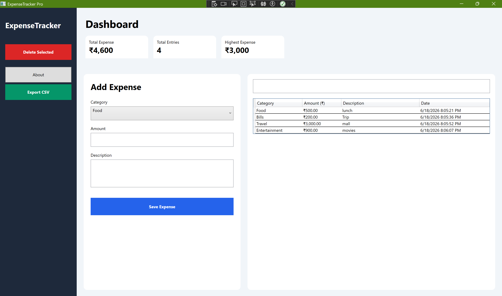

# ExpenseTracker Pro

A modern desktop expense management application built using **C#**, **WPF**, **SQLite**, and **Entity Framework Core**. The application helps users efficiently manage daily expenses through an intuitive dashboard, category-based tracking, real-time statistics, search functionality, and CSV export support.

---

## 🚀 Features

### Expense Management
- Add new expenses
- Update existing expenses
- Delete selected expenses
- Category-based expense organization

### Dashboard Analytics
- Total Expense Summary
- Total Expense Entries
- Highest Expense Tracking
- Real-time dashboard updates

### Search & Filtering
- Instant category-based search
- Dynamic filtering of expense records

### Data Management
- SQLite database integration
- Entity Framework Core ORM
- Persistent local data storage

### Export Functionality
- Export expense records to CSV
- One-click report generation

### User Interface
- Modern WPF Desktop UI
- Responsive layout
- Professional dashboard design
- Easy-to-use navigation panel

---

## 🛠️ Technologies Used

| Technology | Purpose |
|------------|----------|
| C# | Application Logic |
| WPF | Desktop User Interface |
| SQLite | Local Database |
| Entity Framework Core | Database ORM |
| .NET 10 | Application Framework |

---

## 📸 Application Preview

### Dashboard



---

## 📂 Project Structure

```text
ExpenseTrackerPro
│
├── Data
│   └── ExpenseDbContext.cs
│
├── Models
│   └── Expense.cs
│
├── MainWindow.xaml
├── MainWindow.xaml.cs
├── App.xaml
├── ExpenseTrackerPro.csproj
│
├── Screenshot
│   └── Dashboard.png
│
└── README.md
```

---

## ⚙️ Installation

### Clone Repository

```bash
git clone https://github.com/Raghuvendra30/ExpenseTrackerPro.git
```

### Open Project

```bash
Open ExpenseTrackerPro.slnx
```

### Restore Packages

```bash
dotnet restore
```

### Run Application

```bash
dotnet run
```

Or simply press:

```text
F5
```

inside Visual Studio.

---

## 💡 Key Functionalities

- CRUD Operations
- SQLite Database Integration
- Entity Framework Core
- Dashboard Statistics
- Search Functionality
- CSV Export
- Professional WPF Interface

---

## 🔮 Future Improvements

- Monthly Expense Reports
- Expense Category Charts
- PDF Report Export
- Dark Mode
- Budget Planning System
- Authentication & User Profiles
- Cloud Data Synchronization

---

## 👨‍💻 Developer

**Raghuvendra Pratap Singh**

B.Tech Information Technology  
Amity University Noida

### Connect With Me

- LinkedIn: https://www.linkedin.com/in/raghuvendrapratapsingh30
- GitHub: https://github.com/Raghuvendra30

---

## ⭐ Project Status

Version: **v1.0**

This project was developed as a desktop application to demonstrate practical implementation of:

- Object-Oriented Programming
- Database Management
- Entity Framework Core
- Desktop Application Development using WPF
- Software Design Principles

---

### If you found this project useful, consider giving it a ⭐ on GitHub.
